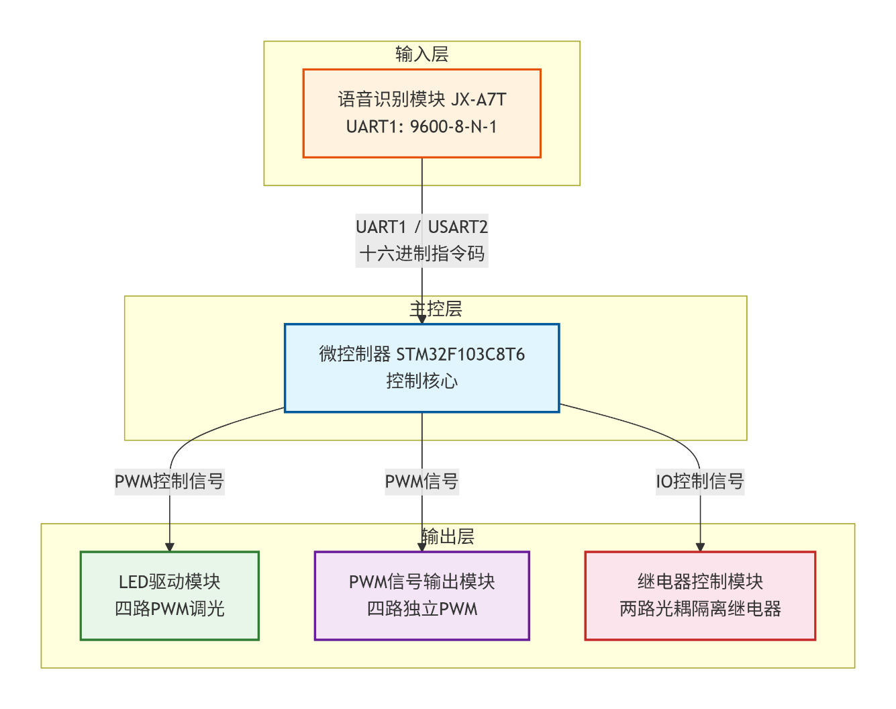
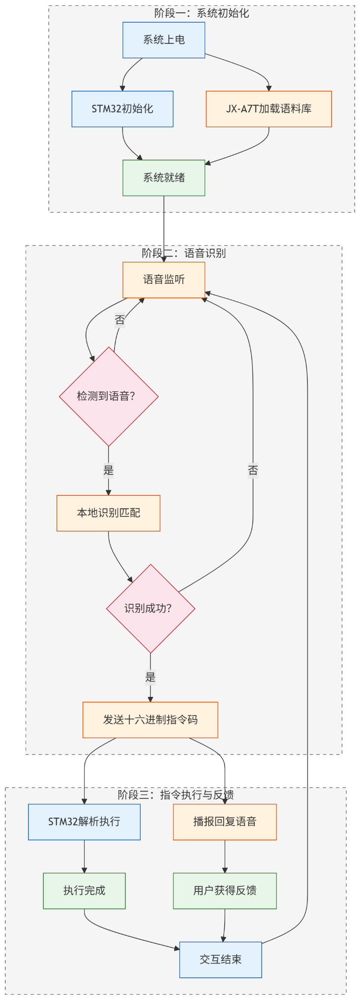
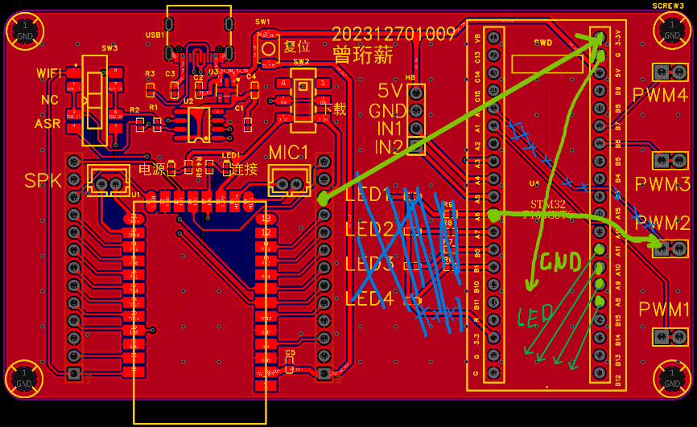
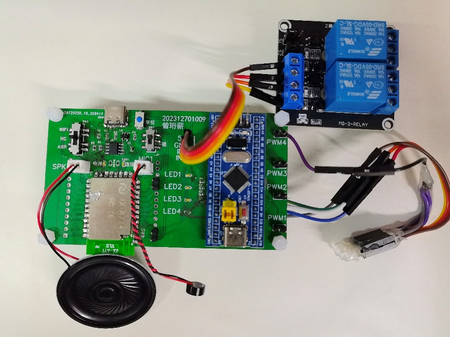
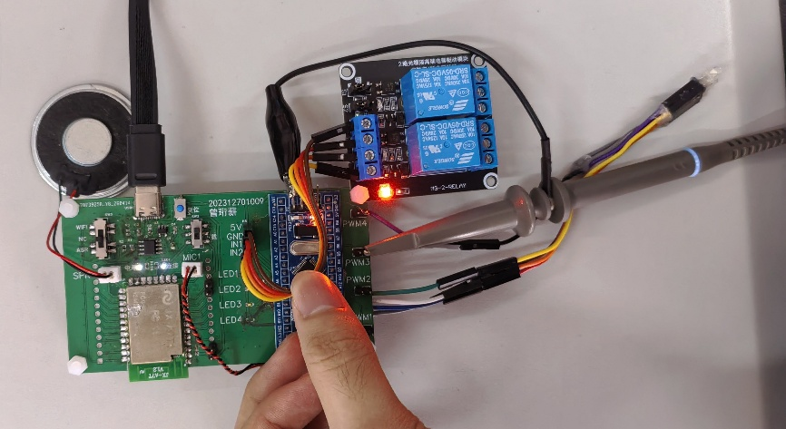
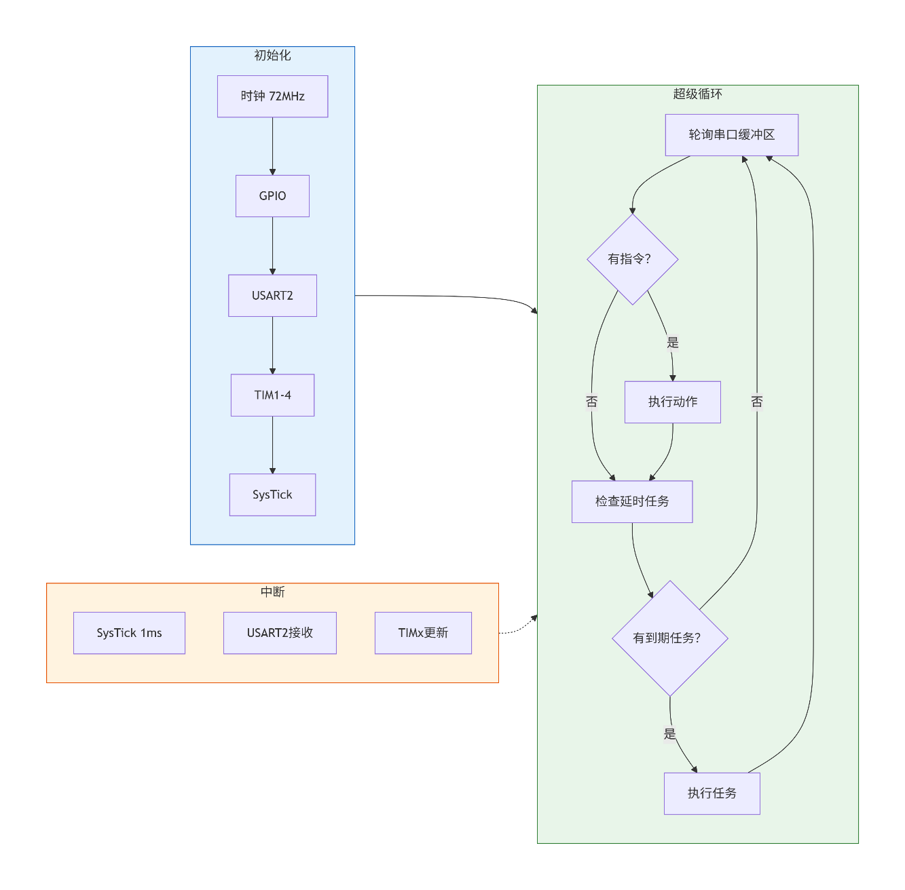
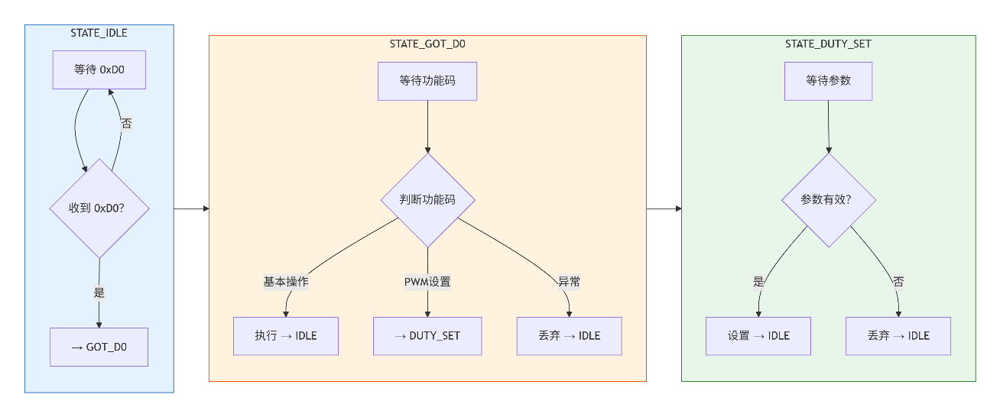
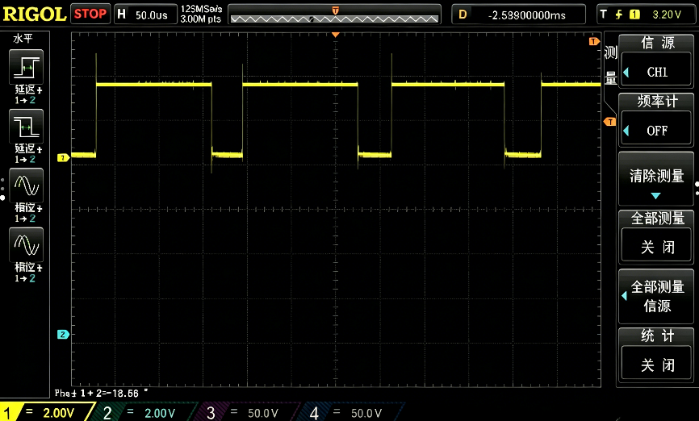

# 基于 STM32 与 JX-A7T 的离线语音智能家居控制系统

> 电子线路课程设计 / 本科毕业论文配套工程
> 一款**不依赖网络、数据全本地处理**的语音家居控制器：JX-A7T 负责离线语音识别，STM32F103C8T6 负责指令解析与外设驱动。


---

## 目录

- [1. 项目简介](#1-项目简介)
- [2. 系统架构](#2-系统架构)
- [3. 功能特性](#3-功能特性)
- [4. 硬件设计](#4-硬件设计)
- [5. 引脚分配](#5-引脚分配)
- [6. 通信协议与指令表](#6-通信协议与指令表)
- [7. 软件设计](#7-软件设计)
- [8. 系统测试](#8-系统测试)
- [9. 仓库结构](#9-仓库结构)
- [10. 快速开始](#10-快速开始)
- [11. 性能指标](#11-性能指标)
- [12. 改进方向](#12-改进方向)
- [13. 参考资料](#13-参考资料)

---

## 1. 项目简介

随着物联网与人工智能的发展，语音成为最自然的人机交互方式之一。市面上的语音家居方案大多依赖云端识别，存在**延迟高、断网即失效、语音数据上传带来的隐私风险**等问题。

本系统采用**离线语音识别**方案：语音信号在本地完成端点检测、特征提取（MFCC）与模板匹配，识别结果以十六进制指令码通过 UART 发送给 STM32，由 STM32 完成指令解析并驱动 LED、PWM 与继电器执行动作，最后由语音模块播报回复语，形成完整的人机交互闭环。

**核心特点**

| 特点 | 说明 |
| --- | --- |
| 完全离线 | 无需 Wi-Fi / 云服务，断网可用，识别延迟低 |
| 隐私安全 | 语音数据不出本地，无需上传云端 |
| 成本低廉 | 核心器件合计约 **50 元** |
| 部署简单 | 上电即用，无需配网、无需账号 |
| 模块化 | 底板 + 模块化接口，便于组装、扩展与维护 |

---

## 2. 系统架构

系统由五部分组成：**语音识别模块（JX-A7T）**、**微控制器模块（STM32F103C8T6）**、**LED 驱动模块（四路 PWM 调光）**、**PWM 信号输出模块（四路独立 PWM）**、**继电器控制模块（两路光耦隔离）**。



工作流程分为三个阶段（初始化 → 语音识别 → 指令执行与反馈）：



1. **上电初始化**：STM32 完成时钟、GPIO、定时器、串口初始化；JX-A7T 自动加载已烧录的命令词语料库。
2. **语音识别**：JX-A7T 持续监听环境声音，检测到语音后启动本地识别并与命令词模板匹配。
3. **指令传输**：识别成功后，通过 UART 发送对应的十六进制指令码。
4. **指令解析**：STM32 以状态机解析指令码，判定控制对象与操作类型。
5. **执行动作**：操作定时器 / PWM 通道 / GPIO，完成亮度调节、占空比调整、继电器通断或延时任务。
6. **反馈确认**：JX-A7T 播报预设回复语，形成交互闭环。

---

## 3. 功能特性

- **语音命令识别**：支持中文命令词，本系统配置 **40 条**命令词（LED 16 条 + PWM 16 条 + 继电器 8 条），安静环境下识别率 ≥ 90%。
- **LED 调光**：4 路独立控制，支持全开 / 全关 / 调亮 25% / 调暗 25%，PWM 无级调光、无可见闪烁。
- **PWM 信号输出**：4 路独立通道，频率与占空比可配置；支持开启、关闭（强制低电平）、占空比 ±10%。
- **继电器控制**：2 路光耦隔离继电器，支持即时闭合 / 断开，以及 **5 秒延时**闭合 / 断开；任务队列支持 4 个并发延时任务。
- **语音反馈**：每条指令均带回复语，操作结果即时确认。
- **异常容错**：非预期字节直接丢弃，指令序列超时（> 100 ms）自动复位状态机。

---

## 4. 硬件设计

### 4.1 STM32F103C8T6 最小系统

选型依据：Cortex-M3 @72 MHz，性能充足；4 个定时器（TIM1~TIM4）可输出多路 PWM；3 个 USART 满足通信与调试；37 个 GPIO；价格低、资料丰富。

- **电源**：2.0~3.6 V（典型 3.3 V），AMS1117-3.3 由 5 V USB 降压；每个 VDD 就近放置 100 nF 去耦电容，VDDA 另加 10 μF 滤波。
- **时钟**：8 MHz 无源晶振（HSE）+ 2×22 pF 负载电容，经内部 PLL 倍频至 72 MHz；32.768 kHz 晶振（LSE）为 RTC 提供时钟。
- **复位**：NRST 经 10 kΩ 上拉至 3.3 V，100 nF 对地实现上电复位，并设手动复位按键。
- **启动**：BOOT0 经 10 kΩ 下拉接地、BOOT1 接地 → 内部 Flash 启动。
- **调试**：引出 SWD（PA13/PA14）。

### 4.2 JX-A7T 离线语音识别模块

- 支持中文命令词离线识别，命令词数量可配置（**50 条以上**）；
- 识别距离约 **3~5 m**（安静环境）；
- 内置语音播报，可自定义回复语；
- 供电 5 V，待机约 30 mA、识别时约 80 mA；
- 支持 UART / I²C / SPI，本系统使用 UART。

**命令词配置三要素**：命令词（同义词用 `|` 分隔）、动作码（识别后经 UART 发送的数据）、回复语。

**接口电路**：`JX-A7T TXD → PA3 (USART2_RX)`、`RXD → PA2 (USART2_TX)`、`VCC → 5V`、`GND → GND`，通信参数 **9600-8-N-1**。

### 4.3 LED 驱动电路

LED1~LED4 分别由 **PA8 / PA9 / PA10 / PA11**（TIM1 CH1~CH4）直接驱动。TIM1 时钟 72 MHz，PSC = 71（72 分频）、ARR = 999 → PWM 频率约 **1 kHz**，CCR 取值 0~999 对应 0%~100%，分辨率 **0.1%**。

| 操作 | CCR 变化 |
| --- | --- |
| 全开 | `CCR = 999` |
| 全关 | `CCR = 0` |
| 调亮 | `CCR = min(CCR + 250, 999)` |
| 调暗 | `CCR = max(CCR - 250, 0)` |

> 频率高于 100 Hz 时，人眼视觉暂留使闪烁不可察觉，感知亮度等于平均电流，因此占空比与亮度近似线性。

### 4.4 PWM 信号输出电路

四路通道经排针引出，每路串联 **100 Ω 保护电阻**，防止外部短路损坏 MCU 引脚。

| 通道 | 定时器 / 引脚 | 频率 | 初始占空比 | 适用场景 |
| --- | --- | --- | --- | --- |
| PWM1 | TIM2_CH2 / PA1 | 2 kHz | 50% | 直流电机、LED 灯带 |
| PWM2 | TIM3_CH1 / PA6 | 50 Hz | 7.5% | 舵机（1~2 ms 脉宽） |
| PWM3 | TIM4_CH1 / PB6 | 1 kHz | 50% | 通用 PWM |
| PWM4 | TIM4_CH2 / PB7 | 1 kHz | 50% | 通用 PWM |

### 4.5 继电器控制电路

选用 5 V 双路继电器模块：电磁继电器，触点容量 **10 A / 250 VAC** 或 **10 A / 30 VDC**，支持高低电平触发（跳线选择），光耦隔离，每路带状态指示灯。

- 连接：`IN1 → PA4`、`IN2 → PA5`、`VCC → 5V`、`GND → GND`
- 逻辑（高电平触发）：GPIO 高 → 吸合；GPIO 低 → 断开。

### 4.6 电源电路

USB 5 V 供电：5 V 直供 JX-A7T 与继电器模块；3.3 V 由 **TPSPX3819M5-L-3-3** 从 5 V 转换，为 CH340N 供电，输入并联 10 μF + 100 nF 陶瓷电容，输出加 100 nF；3.3 V 与 IO8 引脚各串 LED + 4.7 kΩ 到地作为电源指示灯。

### 4.7 PCB 设计



- **分区布局**：数字电路、功率电路、电源电路分区，减少相互干扰；
- **去耦就近**：每个 IC 电源脚旁 100 nF，缩短高频回路；
- **功率走线加宽**：满足继电器与 PWM 输出的电流承载；
- **丝印标注**：所有排针接口标注功能名称，便于接线调试。

板载接口：STM32 最小系统板插座（双排排母）、JX-A7T 接口、LED 灯组、4 路 PWM 输出、继电器接口（5V/GND/IN1/IN2）、SWD（3.3V/SWDIO/SWCLK/GND）、Type-C 电源口。

实物与调试环境：

| 系统整体实物图 | 实际测试环境 |
| --- | --- |
|  |  |

---

## 5. 引脚分配

| 功能 | 引脚 | 外设 | 说明 |
| --- | --- | --- | --- |
| 语音模块 RX | PA3 | USART2_RX | 接 JX-A7T TXD |
| 语音模块 TX | PA2 | USART2_TX | 接 JX-A7T RXD |
| LED1~LED4 | PA8 / PA9 / PA10 / PA11 | TIM1 CH1~CH4 | 1 kHz PWM 调光 |
| PWM1 | PA1 | TIM2_CH2 | 2 kHz |
| PWM2 | PA6 | TIM3_CH1 | 50 Hz |
| PWM3 / PWM4 | PB6 / PB7 | TIM4_CH1 / CH2 | 1 kHz |
| 继电器 1 / 2 | PA4 / PA5 | GPIO 推挽输出 | 高电平吸合 |
| 调试 | PA13 / PA14 | SWDIO / SWCLK | 下载与在线调试 |

---

## 6. 通信协议与指令表

### 6.1 帧格式

| 类型 | 长度 | 格式 |
| --- | --- | --- |
| 单字节指令 | 2 字节 | `[0xD0][功能码]` |
| 双字节指令 | 3 字节 | `[0xD0][功能码][参数]` |

`0xD0` 作为帧起始标志用于状态机识别指令边界；功能码区分控制对象与操作类型；参数字节用于 PWM 占空比等需要额外数据的指令。

### 6.2 LED 控制指令

| 中文语音指令 | 指令码 | 说明 |
| --- | --- | --- |
| 打开小灯一 | `D0 11` | LED1 占空比设为 100% |
| 打开小灯二 | `D0 12` | LED2 占空比设为 100% |
| 打开小灯三 | `D0 13` | LED3 占空比设为 100% |
| 打开小灯四 | `D0 14` | LED4 占空比设为 100% |
| 关闭小灯一 | `D0 21` | LED1 占空比设为 0% |
| 关闭小灯二 | `D0 22` | LED2 占空比设为 0% |
| 关闭小灯三 | `D0 23` | LED3 占空比设为 0% |
| 关闭小灯四 | `D0 24` | LED4 占空比设为 0% |
| 调暗小灯一 ~ 四 | `D0 41` ~ `D0 44` | 对应 LED 亮度降低 25% |
| 调亮小灯一 ~ 四 | `D0 51` ~ `D0 54` | 对应 LED 亮度提高 25% |

### 6.3 PWM 输出指令

| 中文语音指令 | 指令码 | 说明 |
| --- | --- | --- |
| 输出一打开 | `D0 61` | PWM1：2 kHz，50% 占空比 |
| 输出二打开 | `D0 62` | PWM2：50 Hz，50% 占空比 |
| 输出三打开 | `D0 63` | PWM3：1 kHz，50% 占空比 |
| 输出四打开 | `D0 64` | PWM4：1 kHz，25% 占空比 |
| 输出一 ~ 四关闭 | `D0 71` ~ `D0 74` | 对应通道输出低电平 |
| 输出一 ~ 四降低十占空比 | `D0 91` ~ `D0 94` | 对应通道占空比 −10% |
| 输出一 ~ 四提高十占空比 | `D0 A1` ~ `D0 A4` | 对应通道占空比 +10% |

### 6.4 继电器控制指令

| 中文语音指令 | 指令码 | 说明 |
| --- | --- | --- |
| 继电器一闭合 | `D0 06` | PA4 输出高电平，继电器 1 吸合 |
| 继电器二闭合 | `D0 08` | PA5 输出高电平，继电器 2 吸合 |
| 继电器一断开 | `D0 07` | PA4 输出低电平，继电器 1 释放 |
| 继电器二断开 | `D0 09` | PA5 输出低电平，继电器 2 释放 |
| 五秒后打开一 / 二 | `D0 B1` / `D0 B2` | 延时 5 s 后 PA4 / PA5 输出高电平 |
| 五秒后关闭一 / 二 | `D0 C1` / `D0 C2` | 延时 5 s 后 PA4 / PA5 输出低电平 |

---

## 7. 软件设计

### 7.1 分层架构

| 层次 | 内容 |
| --- | --- |
| 应用层 | 控制逻辑、指令调度、状态管理、异常处理 |
| 中间件层 | 串口指令解析器（状态机）、PWM 控制、继电器控制、SysTick 延时管理 |
| 硬件抽象层（HAL） | GPIO / USART / TIM 外设驱动（标准外设库或 HAL 库） |

### 7.2 主程序流程：初始化 + 超级循环



上电依次完成：系统时钟配置（HSE + PLL → 72 MHz）→ GPIO 初始化 → USART2 配置（9600-8-N-1）→ TIM1/TIM2/TIM3/TIM4 PWM 初始化 → SysTick 配置（1 ms 中断）。

主循环中轮询串口接收缓冲区解析语音指令，同时检查延时任务队列并执行到期任务。中断源包括 SysTick（1 ms）、USART2 接收、TIMx 更新。

### 7.3 串口通信实现

- USART2 异步模式，9600-8-N-1，无硬件流控；PA2 复用推挽、PA3 浮空输入；使能接收中断（抢占优先级 1、响应优先级 0）。
- 每收到一个字节触发中断，存入环形缓冲区，同时通过 USB 转串口**回显**给上位机，便于观察通信过程、快速定位故障。

### 7.4 状态机指令解析



三状态模型，在主循环中轮询执行：

| 状态 | 行为 |
| --- | --- |
| `STATE_IDLE` | 等待帧头 `0xD0`，收到后进入 `GOT_D0` |
| `STATE_GOT_D0` | 按功能码判定：基本操作 → 立即执行并回 `IDLE`；PWM 设置 → 进入 `DUTY_SET`；异常 → 丢弃并回 `IDLE` |
| `STATE_DUTY_SET` | 收到参数字节后执行设置并回 `IDLE`；参数无效则丢弃 |

容错：任何状态下收到意外字节直接丢弃；指令序列超时（> 100 ms）自动复位到 `IDLE`。

### 7.5 PWM 控制

- LED 亮度经 TIM1 CCR 调节（0~999 对应 0%~100%），每次步进 250（25%），实现四档调光；
- 独立 PWM 占空比经对应通道 CCR 调节，每次步进 10%（增量 = ARR × 0.1）；
- PWM 开关通过 CCER 寄存器使能 / 禁用输出，关闭时强制低电平，避免引脚悬空。

### 7.6 延时任务调度

基于 SysTick 的轻量调度机制（无需 RTOS）：

- SysTick 1 ms 中断作为时基；
- 每个任务包含目标时间戳、任务类型、继电器编号；
- 收到延时指令时创建任务并计算目标时刻（当前 + 5000 ms）；
- 主循环调用 `DelayTask_Process()` 检查并执行到期任务；
- 任务队列支持 **4 个并发任务**。

---

## 8. 系统测试

### 8.1 串口通信测试

以 USB 转 TTL 模块配合 PC 串口助手模拟发送指令，发送 `0xD0 0x01`（LED1 开）验证解析执行正确；连续快速发送多指令验证响应速度。结果：通信正常无误码，状态机能正确处理异常数据。

### 8.2 LED 调光测试

以示波器观察 PA8~PA11 波形：



- 全开指令 → `CCR = 999`，占空比 ≈ 100%；
- 全关指令 → `CCR = 0`，持续低电平；
- 调亮 / 调暗指令 → CCR 以 250 为步长阶梯变化；
- 实测频率约 1 kHz，与理论一致；四路 LED 响应正常，亮度平滑无闪烁。

### 8.3 PWM 输出测试

| 通道 | 实测结果 |
| --- | --- |
| PWM1 | 2 kHz / 50% 占空比 |
| PWM2 | 50 Hz（20 ms 周期），可输出 1~2 ms 舵机信号 |
| PWM3 / PWM4 | 1 kHz / 50% 占空比 |

四路均可由语音指令独立控制，占空比步进 10% 与设计一致。

### 8.4 继电器控制测试

- **即时控制**：GPIO 高 → 继电器立即吸合、指示灯亮起、万用表确认触点导通；GPIO 低 → 立即释放；
- **延时控制**：延时 5 s 闭合 / 断开；
- **并发测试**：两路同时控制互不干扰。

### 8.5 测试结论

系统能够稳定可靠地完成各项控制任务，验证了硬件电路与状态机解析协议的正确性。

---

## 9. 仓库结构

```text
.
├── README.md                          # 本文件
├── 电子线路课程设计-课程论文.docx        # 课程设计论文（完整设计说明与测试数据）
└── docs/
    └── images/                        # 论文配图（体系结构、流程、PCB、实物与波形）
```

---

## 10. 快速开始

### 10.1 硬件准备

| 器件 | 数量 |
| --- | --- |
| STM32F103C8T6 最小系统板 | 1 |
| JX-A7T 离线语音识别模块（含麦克风、喇叭） | 1 |
| 5 V 双路继电器模块（光耦隔离） | 1 |
| LED 及限流电阻 | 4 |
| USB 转 TTL 模块（调试用） | 1 |
| 自制底板 PCB / 杜邦线 | 1 套 |

### 10.2 接线

按[第 5 节引脚分配](#5-引脚分配)连接，注意：

1. JX-A7T 与继电器模块使用 **5 V** 供电，STM32 使用 **3.3 V** 逻辑；
2. 语音模块 TXD 接 STM32 **PA3**，RXD 接 **PA2**，通信参数 9600-8-N-1；
3. 继电器跳线选择**高电平触发**；
4. 共地。

### 10.3 命令词烧录

使用 JX-A7T 官方 PC 端配置工具，按[第 6 节指令表](#6-通信协议与指令表)逐条录入「命令词 / 动作码 / 回复语」三元组并烧录至模块。本系统共 40 条命令词。

### 10.4 编译与下载

1. 开发环境：**Keil MDK**（或 STM32CubeIDE / IAR EWARM），基于 STM32 标准外设库或 HAL 库；
2. 建立工程并加入 GPIO / USART / TIM / SysTick 驱动与应用逻辑；
3. 通过 **SWD**（PA13/PA14）下载程序；
4. 上电后系统自动初始化，串口助手（9600-8-N-1）可观察指令回显，便于联调。

### 10.5 使用示例

```text
用户：打开小灯一
JX-A7T：(本地识别) → 发送 0xD0 0x11 → 播报回复语
STM32：USART2 中断接收 → 状态机解析 → TIM1 CH1 CCR = 999
结果：LED1 全亮（约 1 kHz PWM，占空比 100%）
```

---

## 11. 性能指标

| 指标 | 设计值 |
| --- | --- |
| 语音识别准确率 | ≥ 90%（安静环境） |
| 命令词数量 | 40 条（模块支持 50 条以上） |
| LED 调光通道 | 4 路，PWM 频率 ≥ 1 kHz，调光分辨率 0.1% |
| PWM 输出通道 | 4 路，频率与占空比独立可配置 |
| 继电器通道 | 2 路，支持即时与 5 s 延时控制 |
| 通信接口 | UART，9600-8-N-1 |
| 延时任务并发数 | 4 |
| 核心器件成本 | 约 50 元 |

---

## 12. 改进方向

1. **提升语音识别能力**：采用更高性能的离线语音芯片，支持自然语言指令，引入声纹识别实现用户身份验证；
2. **优化人机交互**：增加 OLED 状态显示，丰富语音反馈，实现更自然的对话式交互；
3. **降低功耗**：换用低功耗 MCU（如 STM32L 系列），软件支持睡眠模式，适配电池供电场景；
4. **标准化与产品化**：设计专用 PCB、优化外观结构，通过 CCC / CE 等认证，实现批量生产与推广。

---

## 13. 参考资料

1. 黄李健. 基于语音识别的智能家居控制系统设计[J]. 电子测试, 2022(24): 25-26.
2. 张立, 李林, 林祥锐, 等. 基于 STM32 的智能家居控制系统设计[J]. 现代计算机, 2024, 30(12): 114-117.
3. 杨凡, 杨迎尧, 邹杰, 等. 基于语音识别的智能家居系统的设计与开发[J]. 现代信息科技, 2019(9): 164-167.
4. 吴东洋, 宿宁, 张正勇. 基于 STM32 输出指定个数 PWM 波的实现和性能分析[J]. 仪表技术, 2018(7): 1-4.
5. 基于 STM32 步进电机多细分控制的设计[J]. 科学技术与工程, 2013, 23(13): 6893-6897.
6. Rusli M R, Jati M P, Nugroho M A B, et al. BLDC Motor Drives with A Programmable Simplified C-Block to Generate Accurate Six-Step PWM Based on STM32 Microcontroller[J]. Elinvo, 2022, 7(2): 112-118.
7. 机芯智能. JX-A7T AI 大模型模块产品介绍[EB/OL]. <https://www.aimachip.com/product/83-cn.html>, 2025-06-28.
8. 刘火良, 杨森. STM32 库开发实战指南[M]. 北京: 机械工业出版社, 2013.
9. 张毅刚. 单片机原理及应用——基于 STM32F103 系列[M]. 北京: 人民邮电出版社, 2021.
10. 严美珍. 基于 Wi-Fi 控制的智能家居监控系统软硬件设计[J]. 科技创新与应用, 2024, 14(5): 32-35.

---

## 作者

**曾珩薪** · 电子与信息工程学院 / 集成电路学院 · 电子信息工程
指导教师：**廖志贤 副教授**

> 设计细节、原理图、PCB 与完整测试数据见 [`电子线路课程设计-课程论文.docx`](电子线路课程设计-课程论文.docx)。

## 许可

本项目为课程设计 / 毕业论文成果，仅用于学习与交流。如需引用或用于商业用途，请先联系作者。
